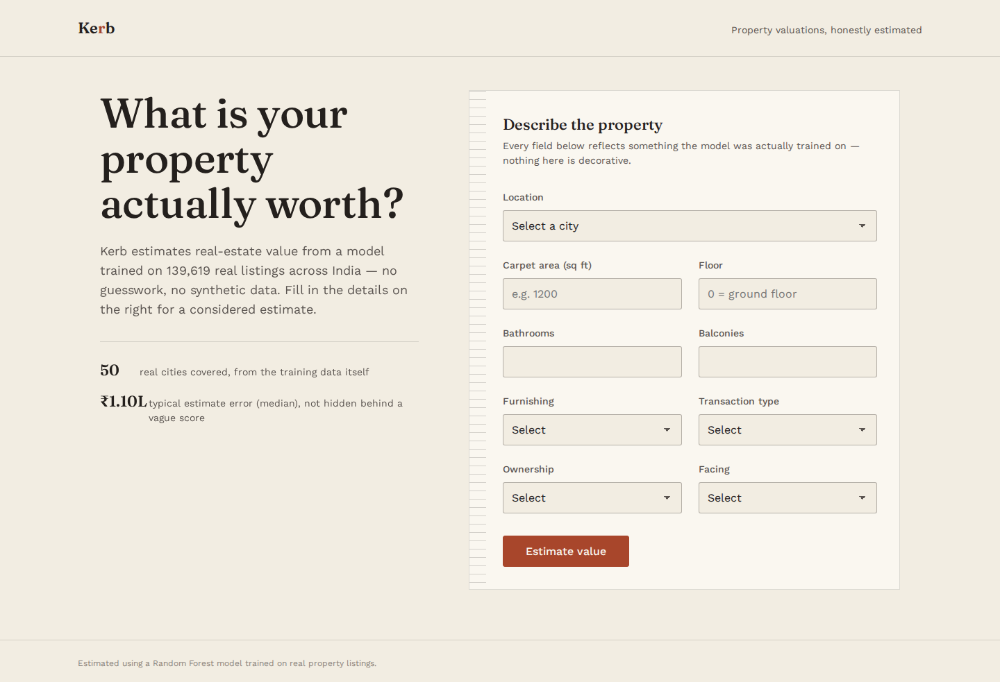
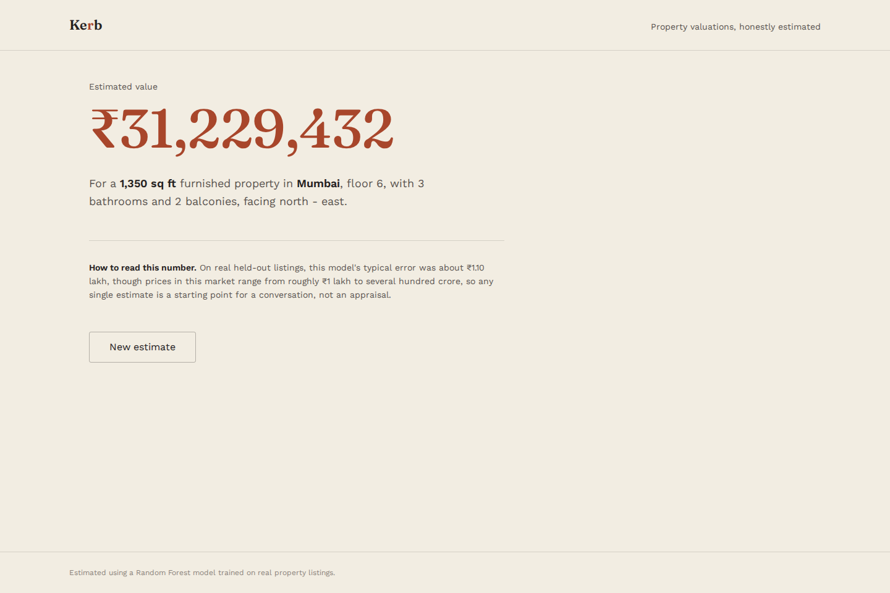
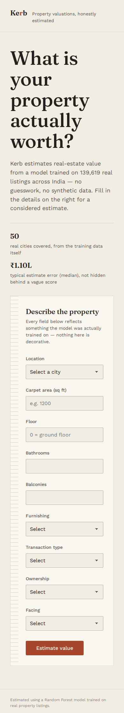

# Kerb — Real-Estate Price Valuation

An end-to-end house-price valuation app: a model trained on a real Kaggle
dataset, served by a FastAPI backend, with a React frontend for entering
a property's details and getting an estimate.

No synthetic data is used anywhere in this project — every number in the
model, every metric below, and every prediction the app makes traces back
to the real dataset.

## Overview

- **ML**: RandomForest + LinearRegression trained and compared on the
  real "House Price" dataset (Juhi Bhojani, Kaggle) — 187,531 real
  Indian real-estate listings.
- **Backend**: FastAPI service that loads the winning model once at
  startup and serves `/predict`.
- **Frontend**: React + TypeScript + Vite app ("Kerb") — a single-page
  valuation form and result view, styled as an editorial property
  ledger rather than a generic dashboard.

## Architecture

```
 React (Vite, :5173)
   │  POST /predict  (VITE_API_BASE_URL, no hardcoded URL)
   ▼
 FastAPI (:8000)
   │  loads once at startup (lifespan)
   ▼
 house_price.pkl  (sklearn Pipeline: ColumnTransformer + RandomForest,
                    trained on the real Kaggle dataset)
```

## Tech stack

| Layer | Stack |
|---|---|
| ML | pandas, scikit-learn 1.8.0, joblib, Jupyter |
| Backend | FastAPI, Pydantic v2 / pydantic-settings, uvicorn, pytest, httpx |
| Frontend | React 19, TypeScript, Vite, react-router-dom |
| Fonts | Fraunces (display serif), Work Sans (UI sans) — self-hosted via `@fontsource` |

## Project structure

```
house_price_project/
├── data/
│   └── house_prices.csv          <- NOT included in this archive (see below)
├── notebooks/
│   └── house_price_model.ipynb   <- full ML pipeline, executed end-to-end
├── src/                           <- ML pipeline source (mirrors the notebook)
│   ├── data_loader.py
│   ├── feature_engineering.py
│   ├── preprocessing.py
│   ├── train_model.py
│   └── predict.py
├── models/
│   └── house_price.pkl           <- winning model (RandomForest), 28.17 MB
├── outputs/
│   └── locations.json            <- Top-50 real locations kept as model categories
├── backend/                       <- FastAPI service (see backend/README below)
│   ├── app/
│   ├── models/                    <- copy of house_price.pkl + locations.json
│   ├── tests/
│   ├── requirements.txt
│   ├── .env.example
│   └── Dockerfile
├── frontend/                      <- React app
│   ├── src/
│   ├── package.json
│   └── .env.example
└── README.md                      <- this file
```

## Dataset + download instructions

This archive does **not** include `data/house_prices.csv` — it's a
~187k-row file and is intentionally excluded to keep the repo small.
To reproduce the ML phase:

1. Download the "House Price" dataset by Juhi Bhojani from Kaggle.
2. Place the CSV at `data/house_prices.csv`.
3. `pip install -r requirements.txt`
4. Run `notebooks/house_price_model.ipynb` top to bottom, or
   `python src/train_model.py`.

The already-trained `models/house_price.pkl` and `outputs/locations.json`
**are** included, so the backend and frontend run without needing the
raw CSV at all.

## Model metrics and selected model

Two regression models were trained on the same real train/test split,
the same outlier-filtered data (see "Outlier removal" below), the same
Top-50 + "other" location grouping (see "Location handling" below), and
the same preprocessing, then compared honestly:

| Model | MAE (₹) | RMSE (₹) | R² (raw) | MedAE (₹) | R² (log scale) | R² (99th-pct trimmed) |
|---|---|---|---|---|---|---|
| **RandomForest — winner** | **1,123,263** | 3,546,205 | **0.9188** | **110,073** | **0.9211** | **0.9138** |
| LinearRegression | 1,579,525,807 | 294,171,352,725 | -559,042,837.30 | 1,839,032 | 0.7242 | -0.5938 |

(Held-out test set: 34,872 rows, after outlier removal — see below. All
figures are test-set metrics, computed on data the model never trained on.)

Raw-scale and log/trimmed-scale metrics are kept in clearly separate
columns above; the log/trimmed numbers are additional context, never a
substitute for the raw ones.

**Winner: RandomForest**, selected on MAE (rupee-scale) as the primary
criterion, decided as a rule before looking at which model it favors. It
wins on every metric here.

**A genuine, non-fabricated finding — LinearRegression's raw-scale
blowup:** after outlier removal, LinearRegression's raw MAE/RMSE/R² look
absurd. This is not a bug: for a small number of test rows, the
unregularized linear model's *log-space* prediction is unusually large,
and `expm1(...)` of that turns into an astronomical rupee figure that
dominates MAE/RMSE/R² even though most of its predictions are
reasonable. This is a known failure mode of plain OLS on high-cardinality
one-hot categorical data combined with a log1p/expm1 target transform.
`MedAE` and `R2_log` — both far less sensitive to a handful of extreme
predictions — show it more fairly: LinearRegression's typical error is
large but not absurd, while RandomForest is simply the better model
here. This is reported as-is rather than fixed by clipping predictions,
per the requirement not to artificially improve metrics.

**Log-transform methodology:** both models are wrapped in
`sklearn.compose.TransformedTargetRegressor(func=np.log1p,
inverse_func=np.expm1)`. Each model is *fit* on `log1p(price)`;
`.predict()` automatically inverts back to real rupees before any metric
is computed, so every number above is in real rupees, not log-rupees.

**Model size:** the unconstrained RandomForest (150 trees, unlimited
depth) serialized to 231MB. Capping `max_depth=16, min_samples_leaf=2`
plus `joblib.dump(..., compress=3)` brought the final, currently-packaged
model to **28.17 MB** (28,165,781 bytes) — under the 50MB guide limit.
The compressed file was reload-verified to produce identical predictions
to the in-memory model.

## Outlier removal (cleaning & feature engineering)

Per the project guide, listings with an absurd real price-per-sqft
(`price_rupees / area_sqft`) are removed as part of cleaning:

- **Rule:** remove listings whose price-per-sqft falls below the 1st
  percentile or above the 99th percentile.
- **Rows before outlier removal** (post-cleaning, both splits combined): **177,847**
- **Rows after outlier removal** (both splits combined): **174,491**
  (139,619 train + 34,872 test)
- **Bounds used:** [₹2,256, ₹33,882] per sqft.

**Leakage safety — thresholds come from the training split only.**
Cleaning/parsing (`clean_real_dataset`) is per-row logic with no leakage
risk and happens before the split. The train/test split then happens
*before* any percentile is computed. The 1st/99th percentile bounds are
computed from `y_train` / `X_train['area_sqft']` **only**, then applied
to both the training split (removing outliers from what the model learns
from) and the test split (removing outliers from what it's evaluated
on) — the same bounds on both, never refit on test data. This mirrors
how any other fitted statistic (e.g. an imputer's median) is handled:
fit on train, applied to test, never fit on test.

**Missing/invalid area handled safely.** Listings with missing or
non-positive area have an undefined price-per-sqft ratio and are
**kept**, not removed — dropping them on a ratio we can't actually
compute would discard real, otherwise-usable listings on a criterion we
have no evidence for. Missing area is already flagged via `area_missing`
and handled by imputation in the preprocessing pipeline. See
`src/feature_engineering.py`'s `compute_price_per_sqft_bounds()` and
`filter_price_per_sqft_outliers()` for the implementation, and the
notebook's Section 5 for the full walkthrough with a bounds-vs-distribution
plot.

## Location handling

The real cleaned dataset contains **81 distinct real locations**. Per
the project guide, this is handled with an explicit **Top-50 + "other"**
grouping strategy, implemented in the actual training/inference code
(not just documented):

- **Top-50 locations are computed from the training split only**
  (`compute_top_n_locations()` in `src/feature_engineering.py`, called
  on `X_train['location']` after outlier removal) — never from the test
  split.
- **Every other location is mapped to a literal `"other"` category**
  (`apply_location_grouping()`), using that same train-derived Top-50
  set, applied identically to both the training split and the test
  split. This makes `"other"` a genuine, *learned* model category — real
  training rows are labeled `"other"` and the model learns an actual
  price effect for it — not just a zeroed-out fallback that only appears
  at inference time.
- Of the 139,619 outlier-filtered training rows, 2,243 (and 575 of the
  34,872 test rows) were grouped into `"other"`.
- The exported `outputs/locations.json` (copied to
  `backend/models/locations.json`) contains exactly these **50** real
  location names — not all 81 — since `"other"` isn't a real place to
  offer as a frontend dropdown choice.

**The backend applies the identical grouping at inference time**, not a
separate or approximate rule: `backend/app/services/preprocessing.py`'s
`map_location_to_group()` checks a submitted location against the same
Top-50 set loaded from `locations.json` and maps anything else —
including a real location outside the Top 50 (e.g. `"madurai"`, one of
the original 81) and any location the model has never seen at all — to
`"other"`, exactly like training did. The API response's
`location_recognized` flag reports whether the submitted location
matched one of the Top-50 individually-modeled categories.

## Backend setup

```bash
cd backend
python -m venv .venv && source .venv/bin/activate
pip install -r requirements.txt
cp .env.example .env
uvicorn app.main:app --reload --port 8000
```

Runs on `http://localhost:8000`. The model loads once at startup (via
FastAPI's `lifespan`), not on every request.

### Run backend tests

```bash
cd backend
pytest tests/ -v
```

## Frontend setup

```bash
cd frontend
npm install
cp .env.example .env
npm run dev
```

Runs on `http://localhost:5173`. `VITE_API_BASE_URL` in `.env` controls
which backend it talks to — no backend URL is ever hardcoded in a
component.

### Build for production

```bash
npm run build
```

## Environment variables

**backend/.env**
| Variable | Default | Purpose |
|---|---|---|
| `MODEL_PATH` | `models/house_price.pkl` | Path to the trained pipeline |
| `LOCATIONS_PATH` | `models/locations.json` | Real locations, for the `location_recognized` flag |
| `CORS_ORIGINS` | `http://localhost:5173` | Comma-separated allowed frontend origins |
| `LOG_LEVEL` | `INFO` | Logging verbosity |

**frontend/.env**
| Variable | Default | Purpose |
|---|---|---|
| `VITE_API_BASE_URL` | `http://localhost:8000` | Backend base URL |

## API reference

### `GET /health`

```json
{
  "status": "ok",
  "model_loaded": true,
  "app_name": "House Price Prediction API",
  "version": "1.0.0"
}
```

### `POST /predict`

Request body:

```json
{
  "location": "bangalore",
  "carpet_area_sqft": 1150,
  "floor": 4,
  "bathrooms": 2,
  "balconies": 2,
  "furnishing": "Furnished",
  "transaction": "Resale",
  "ownership": "Freehold",
  "facing": "North"
}
```

Response:

```json
{
  "predicted_price_rupees": 8113391.52,
  "predicted_price_formatted": "₹8,113,392",
  "currency": "INR",
  "model_used": "RandomForestRegressor",
  "location_recognized": true
}
```

Valid values: `furnishing` ∈ {Furnished, Semi-Furnished, Unfurnished};
`transaction` ∈ {New Property, Resale, Rent/Lease, Other}; `ownership` ∈
{Freehold, Leasehold, Co-operative Society, Power Of Attorney}; `facing`
∈ {East, North, North - East, North - West, South, South - East, South
-West, West}. `carpet_area_sqft` must be `> 0`.

### curl example

```bash
curl -X POST http://localhost:8000/predict \
  -H "Content-Type: application/json" \
  -d '{
    "location": "bangalore",
    "carpet_area_sqft": 1150,
    "floor": 4,
    "bathrooms": 2,
    "balconies": 2,
    "furnishing": "Furnished",
    "transaction": "Resale",
    "ownership": "Freehold",
    "facing": "North"
  }'
```

## Screenshots

**Home — the valuation form**


**Result — a real prediction**


**Mobile — responsive layout**



## Complete run instructions

```bash
# Terminal 1 — backend
cd backend
python -m venv .venv && source .venv/bin/activate
pip install -r requirements.txt
cp .env.example .env
uvicorn app.main:app --reload --port 8000

# Terminal 2 — frontend
cd frontend
npm install
cp .env.example .env
npm run dev
```

Then open `http://localhost:5173`, fill in a property's details, and
submit for a real prediction from the real trained model.

## Docker (backend)

```bash
cd backend
docker build -t kerb-backend .
docker run -p 8000:8000 kerb-backend
```
